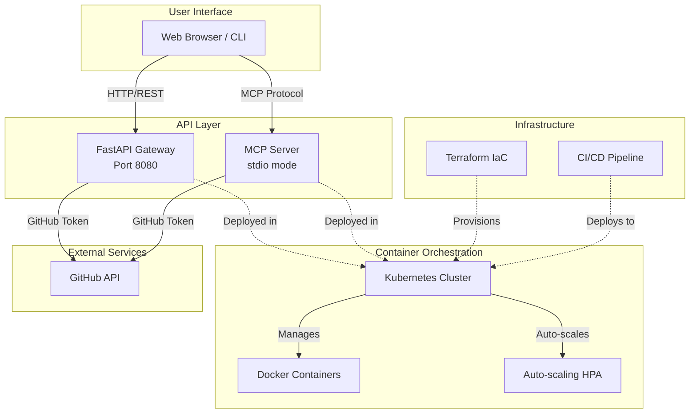

# GitHub Analytics MCP Server — Architecture Reference Project

**Query, analyze, and visualize any public GitHub repository — from the command line, browser, or AI agent.**


---

## Overview

GitHub Analytics MCP Server is a production-ready microservice that turns the GitHub API into a simple, self-hosted analytics endpoint. Point it at any public repository and instantly get structured data on stars, forks, contributors, commit history, and language distribution.

It exposes two interfaces: a **RESTful API** (FastAPI with auto-generated Swagger docs) for direct HTTP access, and a **Model Context Protocol (MCP) server** that lets AI agents like Claude Desktop query GitHub data as a native tool.

The entire stack — API gateway, MCP server, container orchestration, infrastructure provisioning, and CI/CD — is included and deployable with a single command.

This project also serves as an **architecture reference implementation**: every layer is accompanied by design-decision documentation explaining *why* it is structured this way, not just *what* it does.

## Features

- 🔍 **Query any public GitHub repository** by owner/name
- 📊 **Repository statistics** — stars, forks, issues, watchers
- 👥 **Contributor analysis** — top contributors with commit counts
- 📝 **Commit history** — recent commits with author and message details
- 🌐 **RESTful API** with auto-generated OpenAPI/Swagger docs
- 🤖 **MCP Protocol support** for AI agent integration (Claude Desktop, etc.)
- 🐳 **Production-ready** with Docker multi-stage builds and Docker Compose
- ☸️ **Kubernetes deployment** with Deployments, Services, Ingress, and HPA
- 📈 **Auto-scaling** — Horizontal Pod Autoscaler (2–5 replicas, 70% CPU target)
- 🔄 **Full CI/CD pipeline** — lint, test, build, and deploy via GitHub Actions
- 🏗️ **Infrastructure as Code** — Terraform provisions the entire K8s stack

## Why This Project?

| Concern | This Project | Traditional Approach |
|---------|-------------|----------------------|
| Setup | `docker-compose up` or `make k8s-deploy` | Manual server provisioning |
| Scalability | Auto-scaling with K8s HPA (2–5 replicas) | Manual capacity planning |
| Infrastructure | `terraform apply` — one command | Multiple manual steps |
| High Availability | Multi-replica with health checks | Complex setup required |
| Monitoring | Liveness & readiness probes built in | Separate monitoring stack |
| Deployment | Automated CI/CD on every push | Manual release process |
| Portability | Runs anywhere Docker/K8s runs | Environment-dependent |
| API Docs | Auto-generated OpenAPI (Swagger UI) | Manual documentation |

This is not just a tool — it is a **reference implementation** designed for studying architecture patterns. Every layer includes design-decision documentation explaining the reasoning behind its structure.

## Architecture



## Design Philosophy

### One domain, two interfaces, shared core

`GitHubClient` is the single business-logic layer. The MCP Server and FastAPI Gateway are both thin adapters — they translate between their respective protocols and the shared core. Neither contains business logic, and neither duplicates the other.

**Why two interfaces:** MCP serves AI agents over stdio; REST serves humans and programs over HTTP. Two protocols, two adapters, zero duplicated logic.

### Error handling strategy

Custom exception hierarchy (`RepositoryNotFoundError`, `AuthenticationError`, `RateLimitError`) translates GitHub HTTP status codes into semantic domain errors. The MCP server converts these into user-friendly text messages; the FastAPI gateway converts them into the corresponding HTTP status codes (404/401/429/502). Callers never need to know how the GitHub API works internally.

### Infrastructure: three layers for three use cases

- **Docker Compose** — local development. One command (`docker-compose up`) starts everything.
- **Kubernetes manifests (`k8s/`)** — direct `kubectl apply`. Good for learning K8s and quick testing.
- **Terraform (`terraform/`)** — state management, drift detection, multi-environment support. For production.

All three coexist intentionally. Each serves a different stage of the deployment lifecycle.

### Why these numbers

- **HPA 2-5 replicas:** 2 guarantees availability (one pod can fail without downtime); 5 is a cost ceiling.
- **70% CPU threshold:** leaves 30% buffer so existing pods absorb traffic spikes while new pods start (10-30s scheduling window).
- **Resource limits (100m/500m CPU, 128Mi/256Mi memory):** FastAPI + uvicorn idles at ~30m CPU / ~50MB RAM. Limits prevent a runaway process from starving other pods.

### Deliberate omissions

- **No database** — this is a stateless proxy. Every request fetches fresh data from GitHub. Adding a DB would obscure the core architecture pattern.
- **Redis is optional** — available via `docker-compose --profile with-cache up` to demonstrate Docker Compose profiles, but not wired into the application.
- **No auth middleware** — authentication is orthogonal to the architecture being demonstrated. Including it would distract from the layered design.

## Architecture Documentation

For deeper dives into specific decisions:

- **[ARCHITECTURE.md](ARCHITECTURE.md)** — full architecture overview with layer diagram
- **Architecture Decision Records (ADRs):**
  - [ADR-001: Dual MCP + REST Interface](docs/adr/ADR-001-dual-interface.md)
  - [ADR-002: Custom Exception Hierarchy](docs/adr/ADR-002-exception-hierarchy.md)
  - [ADR-003: Multi-Stage Docker Build](docs/adr/ADR-003-multi-stage-docker.md)
  - [ADR-004: Terraform and kubectl Coexistence](docs/adr/ADR-004-terraform-and-kubectl.md)
  - [ADR-005: HPA Configuration Values](docs/adr/ADR-005-hpa-configuration.md)

## Quick Start

### Option 1: Docker Compose (Fastest)

```bash
# 1. Clone and configure
git clone https://github.com/Pyroxyl/github-analytics-mcp.git
cd github-analytics-mcp
cp .env.example .env
# Edit .env and add your GITHUB_TOKEN

# 2. Start services
docker-compose up -d

# 3. Test the API
curl http://localhost:8080/health
curl http://localhost:8080/api/v1/repo/facebook/react/stats | jq
```

### Option 2: Kubernetes (Production)

```bash
# 1. Build and deploy
make build
make k8s-deploy

# 2. Access the API (LoadBalancer on port 80)
curl http://localhost/health
curl http://localhost/api/v1/repo/facebook/react/stats | jq
```

### Option 3: Terraform (Full IaC)

```bash
cd terraform
cp terraform.tfvars.example terraform.tfvars
# Edit terraform.tfvars

terraform init
terraform plan
terraform apply
```

## Usage Examples

### Repository Statistics

```bash
curl "http://localhost/api/v1/repo/facebook/react/stats" | jq
```

```json
{
  "repository": "facebook/react",
  "stars": 242591,
  "forks": 50472,
  "open_issues": 1138,
  "watchers": 6690,
  "description": "The library for web and native user interfaces.",
  "language": "JavaScript"
}
```

### Recent Commits

```bash
curl "http://localhost/api/v1/repo/anthropics/anthropic-sdk-python/commits?limit=3" | jq
```

### Top Contributors

```bash
curl "http://localhost/api/v1/repo/kubernetes/kubernetes/contributors?top_n=5" | jq
```

### Language Distribution

```bash
curl "http://localhost/api/v1/repo/microsoft/vscode/languages" | jq
```

```json
{
  "repository": "microsoft/vscode",
  "languages": {
    "TypeScript": 95.54,
    "CSS": 1.49,
    "JavaScript": 1.0,
    "Rust": 0.61
  }
}
```

### Compare Projects

```bash
# Compare stars across projects
curl -s "http://localhost/api/v1/repo/facebook/react/stats" | jq '.stars'
curl -s "http://localhost/api/v1/repo/vuejs/vue/stats" | jq '.stars'
```

## Interactive API Documentation

🌐 **Live API Docs**: http://localhost/docs (or `http://localhost:8080/docs` for Docker Compose)

FastAPI auto-generates interactive Swagger UI where you can:
- 📖 Browse all available endpoints
- 🎮 Test APIs directly in your browser with "Try it out"
- 📊 View request/response schemas
- 💡 See example values for all parameters
- ✨ Execute real API calls and see live responses

## MCP Client Configuration

Add to your MCP client configuration (e.g., Claude Desktop):

```json
{
  "mcpServers": {
    "github-analytics": {
      "command": "python",
      "args": ["-m", "src.server"],
      "cwd": "/path/to/github-analytics-mcp",
      "env": {
        "GITHUB_TOKEN": "your_token_here"
      }
    }
  }
}
```

Or using Docker:

```json
{
  "mcpServers": {
    "github-analytics": {
      "command": "docker",
      "args": ["run", "--rm", "-i", "--env-file", ".env", "github-analytics-mcp"],
      "cwd": "/path/to/github-analytics-mcp"
    }
  }
}
```

## Tech Stack

| Layer | Technology |
|-------|-----------|
| **Backend** | Python 3.11+, FastAPI, PyGithub |
| **Protocol** | Model Context Protocol (MCP) |
| **Containerization** | Docker (multi-stage builds), Docker Compose |
| **Orchestration** | Kubernetes — Deployments, Services, HPA, Ingress |
| **Infrastructure** | Terraform |
| **CI/CD** | GitHub Actions (lint → test → build → deploy) |

### DevOps Highlights

- Multi-stage Docker builds for minimal image size
- Kubernetes auto-scaling (2–5 replicas based on CPU)
- Liveness & readiness probes for self-healing
- Rolling updates with zero downtime
- Automated lint, test, build, and deploy pipeline

## Project Structure

```
github-analytics-mcp/
├── src/                        # MCP Server
│   ├── server.py               # MCP protocol entry point
│   ├── github_client.py        # GitHub API client wrapper
│   └── tools/                  # MCP tool implementations
│       ├── repo_stats.py       #   get_repo_stats
│       ├── commits.py          #   list_recent_commits
│       ├── contributors.py     #   analyze_contributors
│       └── languages.py        #   get_language_breakdown
├── api/                        # FastAPI Gateway
│   ├── main.py                 # App entry point
│   ├── routes.py               # API route definitions
│   ├── models.py               # Pydantic models
│   └── dependencies.py         # Dependency injection
├── k8s/                        # Kubernetes manifests
│   ├── namespace.yaml
│   ├── configmap.yaml
│   ├── secret.yaml
│   ├── deployment-api.yaml     # API gateway (2 replicas)
│   ├── deployment-mcp.yaml     # MCP server
│   ├── service-api.yaml        # LoadBalancer service
│   ├── hpa-api.yaml            # Horizontal Pod Autoscaler
│   ├── ingress.yaml
│   └── deploy.sh               # Deployment script
├── terraform/                  # Infrastructure as Code
│   ├── main.tf
│   ├── kubernetes.tf
│   ├── providers.tf
│   ├── variables.tf
│   └── outputs.tf
├── .github/workflows/          # CI/CD pipelines
│   ├── ci.yml                  # Lint & test
│   ├── docker-build.yml        # Build & push image
│   └── cd.yml                  # Deploy to K8s
├── tests/                      # Unit tests
├── Dockerfile                  # Multi-stage container build
├── docker-compose.yml          # Local multi-service setup
├── Makefile                    # Convenience commands
├── requirements.txt
└── .env.example                # Environment template
```

## Development

### Prerequisites

- Python 3.11+
- Docker & Docker Compose
- kubectl (for Kubernetes deployment)
- Terraform (for IaC deployment)
- GitHub Personal Access Token ([create one here](https://github.com/settings/tokens))

### Local Development

```bash
python3 -m venv venv
source venv/bin/activate
pip install -r requirements.txt

# Run the MCP server
python -m src.server

# Run the API gateway
uvicorn api.main:app --reload --port 8080

# Run tests
pytest tests/
```

### Make Commands

| Command | Description |
|---------|-------------|
| `make build` | Build Docker image |
| `make run` | Start with Docker Compose |
| `make stop` | Stop all containers |
| `make logs` | View container logs |
| `make k8s-deploy` | Deploy to Kubernetes |
| `make k8s-status` | Check K8s pod/service status |
| `make clean` | Remove containers and images |
| `make help` | Show all available commands |

## CI/CD Pipeline

```
Push/PR → [CI] Lint + Test → [Docker Build] → ghcr.io → [CD] → Kubernetes
```

1. **CI** — Runs `ruff` lint and `pytest` on every push/PR (Python 3.11 & 3.12)
2. **Docker Build** — Builds and pushes images to GitHub Container Registry
3. **CD** — Deploys to Kubernetes via Terraform after successful build

See [`.github/workflows/README.md`](.github/workflows/README.md) for details.

## Production Deployment

### High Availability
- 2+ API gateway replicas with rolling updates
- Automatic pod restart on failure via liveness probes
- Readiness probes prevent traffic to unhealthy pods

### Auto-Scaling
- HPA scales from 2 to 5 replicas
- Target: 70% CPU utilization
- Handles traffic spikes automatically

### Security
- GitHub tokens stored as Kubernetes Secrets
- No credentials in source code or git history
- Ingress-ready for TLS termination

## Use Cases

- 📊 **Project Evaluation** — Quickly assess GitHub projects before adopting them
- 🔍 **Trend Research** — Analyze language trends across popular repositories
- 🤖 **AI Integration** — Enable AI agents to access GitHub data via MCP
- 📈 **Metrics Dashboards** — Build custom dashboards with real-time GitHub stats
- 🔬 **Open Source Research** — Study contributor patterns and project health

## Roadmap

- [ ] Redis caching layer for API responses
- [ ] Prometheus metrics & Grafana dashboards
- [ ] Rate limiting & API key authentication
- [ ] Additional endpoints (pull requests, releases, workflows)
- [ ] Multi-cloud examples (AWS EKS, GCP GKE, Azure AKS)

## Contributing

See [CONTRIBUTING.md](CONTRIBUTING.md) for development workflow and guidelines.

## License

This project is licensed under the MIT License — see the [LICENSE](LICENSE) file for details.

## Acknowledgments

Built with [Model Context Protocol](https://modelcontextprotocol.io/) by Anthropic, [FastAPI](https://fastapi.tiangolo.com/), and [PyGithub](https://github.com/PyGithub/PyGithub).

---

**⭐ If you find this project useful, please star it on GitHub!**

[Issues](https://github.com/Pyroxyl/github-analytics-mcp/issues) · [Project Link](https://github.com/Pyroxyl/github-analytics-mcp)
